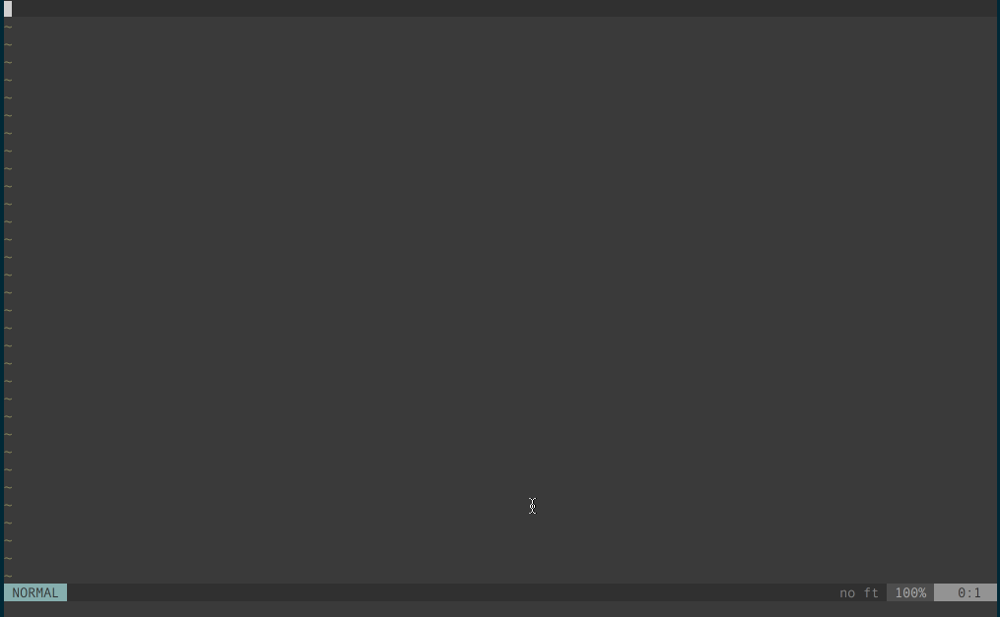

Ranger.vim
==========

[Ranger](http://ranger.nongnu.org/) integration in vim and neovim



Installation
============

Install it with your favorite plugin manager. Example with vim-plug:

        Plug 'francoiscabrol/ranger.vim'

If you use neovim, you have to add the dependency to the plugin bclose.vim:

        Plug 'rbgrouleff/bclose.vim'

How to use it
=============

The default shortcut for opening Ranger is `<leader>f` (\f by default)
To disable the default key mapping, add this line in your .vimrc or init.vim: `let g:ranger_map_keys = 0`

then you can add a new mapping with this line: `map <leader>f :Ranger<CR>`.

The command for opening Ranger in the current file's directory is `:Ranger`.
Vim will open the selected file in the current window. To open the selected
file in a new tab instead use `:RangerNewTab`.

For opening Ranger in the current workspace, run `:RangerWorkingDirectory`.
Vim will open the selected file in the current window.
`:RangerWorkingDirectoryNewTab` will open the selected file in a new tab instead.

List of commands:
```
Ranger // open current file by default
RangerCurrentFile // Default Ranger behaviour
RangerCurrentDirectory
RangerWorkingDirectory

RangerNewTab
RangerCurrentFileNewTab
RangerCurrentDirectoryNewTab
RangerWorkingDirectoryNewTab
```

The old way to make vim open the selected file in a new tab was to add
`let g:ranger_open_new_tab = 1` in your .vimrc or init.vim. That way is still
supported but deprecated.

If you want to see vim opening ranger when you open a directory (ex: nvim ./dir), please add this in your .(n)vimrc.
```
let g:NERDTreeHijackNetrw = 0 // add this line if you use NERDTree
let g:ranger_replace_netrw = 1 // open ranger when vim open a directory
```

